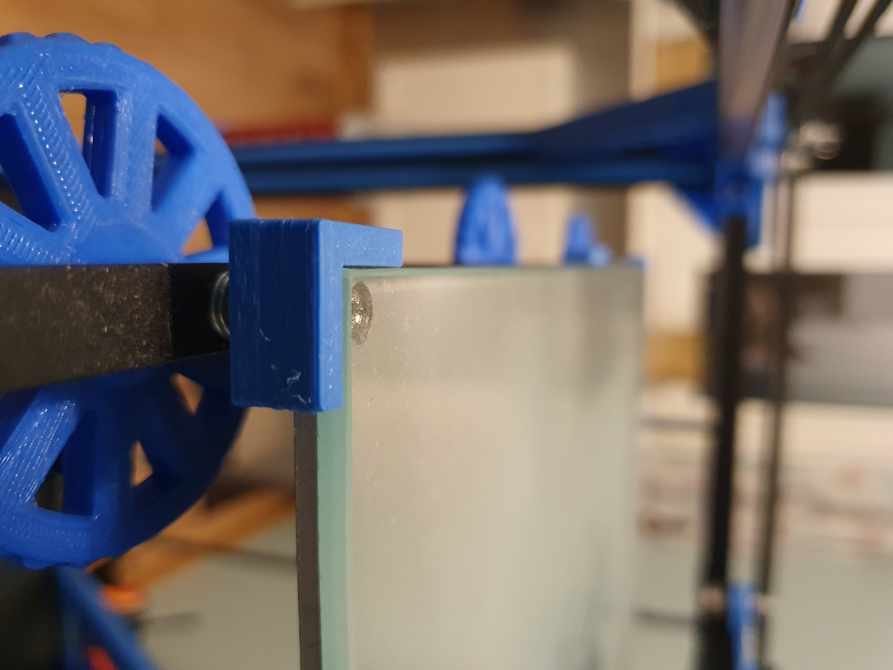

# Tronxy X5S Upgrades and Mods

Want to improve your Tronxy X5S? I want to present my upgrades and mods for Tronxy X5S which 
I made on my printer to improve the quality of the prints.

### 
I am started frot that:

 |  | 
--- | --- | ---

### 
And now it look like this:

 |  | 
--- | --- | ---

# Table of contents
1. [X-Y-Axis Modification](#head1)
2. [Z-Axis Modification](#head2)
3. [Glass and Bed Holders](#head3)
4. [Increase the stability](#head4)
5. [Top Mount Cable Chain](#head5)
6. [Spool and Filament Holder](#head6)
7. [MOSFET for Hotend and Bed](#head7)
8. [Power Switch Mount and Power Supply Holder](#head8)
9. [Power Supply 24V for Bed](#head9)
10. [E3D V6 Hotend](#head10)
11. [Fan Cooler and Hotend Mount](#head11)
12. [32BIT Board (SKR 1.3)](#head12)
13. [BMG Extruder](#head13)
14. [Autolevel with BLTouch](#head14)
15. [LCD Case and secend LCD with Touch Screen](#head15)

## X-Y-Axis Modification 
I have printed a few enhancements for the Tronxy X5S to improve the XY axis. 
Thanks to these modifications, I improved the stability of the carriage and better belt guidance. 
All information about assembly can be found on the thingiverse (link below).
Also I printed a new mount for motor. I was inspired by <a href="https://www.thingiverse.com/thing:2717656">SgaboLab</a> idea, 
but I improved the design by strengthening the structure and improving the assembly. 
Remember to print the second motor tower as a mirror.  

X-Y-Axis Mod | X-Y-Axis Mod | Motor Tower | Motor Tower 
--- | --- | --- | ---
 |  |  | 

Download step: 
<a href="???">X-Y-Axis Mods</a> 
<a href="???">Motor Tower</a> 

Link to thingiverse: 
<a href="https://www.thingiverse.com/thing:2815168">X-Y-Axis Mods</a> 
<a href="https://www.thingiverse.com/thing:2717656">Motor Tower SgaboLab</a> 

## Z-Axis Modification 
Another important right was to stabilize the table, which at first could lose its level. 
For best result I bought linear slide bearing RJ4JP-01 from igus (x16) and trapezoidal nut eliminating play (x2).
Important issue is to remove the stabilizer bearing that stresses the trapezoidal bolt.
This mods allowed me to obtain a rigid table structure.

Z-Axis Mod | Z-Axis Mod | Remove the stabilizer bearing | Trapezoidal nut eliminating play 
--- | --- | --- | ---
 |  |  | 

Download step: 
<a href="???">Z-Axis Mods</a> 

Link to thingiverse: 
<a href="https://www.thingiverse.com/thing:3352437">Z-Axis Mods</a> 

<a href="https://www.thingiverse.com/thing:2760703">Anti Z wobble not recommend</a> 

## Glass and Bed Holders 
The standard printing bed of the Tronxy X5S may be OK for the first steps in 3D printing. 
But you will quickly realize that the filament does not stick well to it and changing the blue-tape constantly is also not an option. 
For this reason, you should get a glass bed. Borosilicate glass is your weapon of choice, because it is shows high chemical resistance 
and allows for high temperatures. Glass with Dimafix guaranted very good adhesion of the first layer to the table. You can also print my
holder for Dimafix can. For fast bed level I printed a Knob. 

Knob | Bed Holders | Bed Holders | Dimafix Holder 
--- | --- | --- | ---
 |  |  | 

Download step: 
<a href="???">Knob</a> 
<a href="???">Bed Holders</a> 
<a href="???">Dimafix Holder</a> 

Link to thingiverse: 
<a href="https://www.thingiverse.com/thing:3216157">Knob</a> 
<a href="https://www.thingiverse.com/thing:2633636">Bed Holders SgaboLab</a> 

## Increase the stability 
Mounting bracket in the corners is an easy and cheap fix to increase the stability of the Tronxy X5S. 
Because the Tronxy X5S is quite high and the main emphasis is mostly also on the top
I created that brace to stabilize the frame for fast, short movements (my version is a modification
project from thingiverse, it is smaller so I could mount it in every corner). On the thingiverse you can find 
another corner bracket you can choose the version you like best.
Adding this simple Tronxy X5S upgrade will prevent the frame from flexing and increase the quality of your prints.

Corner bracket | Stabilization brace  
--- | --- 
 |  

Download step: 
<a href="???">Corner bracket</a> 
<a href="???">Stabilization brace</a> 

Link to thingiverse: 
<a href="https://www.thingiverse.com/thing:2771055">Corner bracket 1</a> 
<a href="https://www.thingiverse.com/thing:2878626">Corner bracket 2</a> 
<a href="https://www.thingiverse.com/thing:2753168">Corner bracket 3</a> 
<a href="https://www.thingiverse.com/thing:2850306">Corner bracket 4</a> 
<a href="https://www.thingiverse.com/thing:3117578">Stabilization brace</a> 

## Top Mount Cable Chain 
While mounting my X5S i found that the cable chain weight pull up the carriage to one side and presses on belt ,so i printed part to mount it on top , 
it also uses less chain. For this mod you must buy two 608 bearings.

Problem with orginal cabel chain | Top mount cabel chain 
--- | --- 
 |  

if you do not want to use this solution, I suggest printing a stiffening bracket for mounting orginal cable chain holder. 
Download step: 
<a href="???">Top Mount Cable Chain</a> 

Link to thingiverse: 
<a href="https://www.thingiverse.com/thing:2809623">Top Mount Cable Chain</a> 
<a href="https://www.thingiverse.com/thing:3355599">Stable cable chain holder</a> 

## Spool and Filament Holder 
For the efficient replacement of the filament, I was able to combine three very good solutions from thingiverse.

Firs is a Master Spool. It is a reusable spool for which you can buy cheaper filament for example "Refill Fiberlogy".
The main advantages are cost and reduced waste. You are also being kinder to the 
environment by reducing waste.  You will no longer have an empty spool to deal with.

Second is Spool Hub, designed to make spool change-outs quick and easy. 
Accommodates spools with a center hole of 50mm - 65mm.

Third is Filament spool holder to shorten the distance between the spool and the extruder.

Download step: 
<a href="???">Spool hub</a> 
<a href="???">Master spool</a> 
<a href="???">Filament spool holder</a> 

Link to thingiverse: 
<a href="https://www.thingiverse.com/thing:2129670">Spool holder</a> 
<a href="https://www.thingiverse.com/thing:3187986">Master spool</a> 
<a href="https://www.thingiverse.com/thing:1241566">Filament spool holder</a> 

## MOSFET for Hotend and Bed 
The addition of a MOSFET is one of the most important Tronxy X5S upgrades you can buy. 
The most common use of the MOSFET with the Tronxy X5S 3D printer is to regulate the high workload 
that the heated bed places upon the mainboard. The high current of the hot bed can lead 
to stress for the mainboard connectors, and increases the possibility of a fire hazard 
or hardware malfunction. Aside from the safety benefits, the MOSFET also allows users to 
apply a second power supply unit (PSU), which will drastically reduce the time it takes 
your heated bed to reach its set temperature. I used to two MOSFET for Bed and Hotend for reduce current
on the mainboard.

Schematic | Dual MOSFET holder 
--- | --- 
 |  

Download step: 
<a href="???">Dual MOSFET holder</a> 

Link to thingiverse: 
<a href="https://www.thingiverse.com/thing:2086107">Dual MOSFET holder</a> 

## Power Switch Mount and Power Supply Holder 
This might seem like a simple addition to the Tronxy X5S, but a power switch should be welcomed 
by 3D printer users with open arms. It is a great protection in the event of a short circuit because 
the switch contains a fuse.  I designed my own bracket for mounting the power supply on the plate at the back of the printer, 
which also has the ability to mount power switch.

Schematic | Power Supply Holder 
--- | --- 
 |  

Download step: 
<a href="???">Power Supply Holder</a> 
<a href="???">Power Supply and Switch Holder</a> 

Link to thingiverse: 
<a href="https://www.thingiverse.com/thing:2717705">Power Supply Holder SgaboLab</a> 
<a href="http://www.thingiverse.com/thing:2078936">Power Supply Holder</a> 

## Power Supply 24V for Bed 
Great upgrade is to add a 24V power supply. I have original 12V power supply for hotend and electronic and another
24V power supply only for bed. Using a 24V power supply unit, you can heat your print bed to a 100 C in 6 to 9 minutes.
To be able to connect the 24V power supply, it is important to solder the cables under the table in the configuration for 24v.
Please note, that you should buy a power supply unit with a current rating of at least 20A / 480W, or even better 25A / 600W.

To reduce temperature dispersion, I buy a Self-Adhesive Aluminum Insulation Mat 300mm x 300mm.
These lightweight insulation mats work really well to keep your 3D printer beds warm throughout the printing process. 
Rather than have your print bed overcompensate for a cool room, and require extra heating, we can keep that heat in better.

## E3D V6 Hotend 
The second 

Do
wnload step: 
<a href="???">Hotend holder and backplate</a> 

## Fan Cooler and Hotend Mount 
When 3D printing with certain materials, a nozzle fan helps to cool freshly extruded plastic and 
keep the 3D print in tip-top quality. In its stock format, the Tronxy X5S does include one of these fans, 
but the original cooling fan blows only from one direction. 
A more efficient cooling fan can easily be 3D printed. To cool printed filament from two directions, 
you can print this Tronxy X5S upgrade. This unique design blows air from two sides towards the nozzle, 
greatly improving the overall quality of your 3D prints.

Download step: 
<a href="???">Fan cooler</a> 

Link to thingiverse: 
<a href="https://www.thingiverse.com/thing:3436250">BMG extruder holder and fan</a> 
<a href="https://www.thingiverse.com/thing:2633989">BMG extruder bowden holder</a> 
<a href="https://www.thingiverse.com/thing:2799683">Backplate for orinal carriage</a> 

## 32BIT Board (SKR 1.3) 
The second 

Download step: 
<a href="???">Skr 1.3 holder</a> 

Link to thingiverse: 
<a href="https://www.thingiverse.com/thing:3639615">SKR 1.3 Holder with 120mm Fan</a> 

Dawnload Marlin 2.0 for my Tronxy X5S:
<a href="???">Marlin 2.0</a> 

## Change bearings and V-slot 
bmg extruder
+ 

## Autolevel with BLTouch 
The second wqqqsdfweq

Download step: 
<a href="???">BLTouch holder</a> 

## LCD Case and secend LCD with Touch Screen 

Download step: 
<a href="???">LCD case</a> 

Link to thingiverse: 
<a href="https://www.thingiverse.com/thing:2627194">LCD case</a> 

http://www.thingiverse.com/thing:3268408 thermometerbox
http://www.thingiverse.com/thing:2494642 hotend mount e3d v6 bowden

